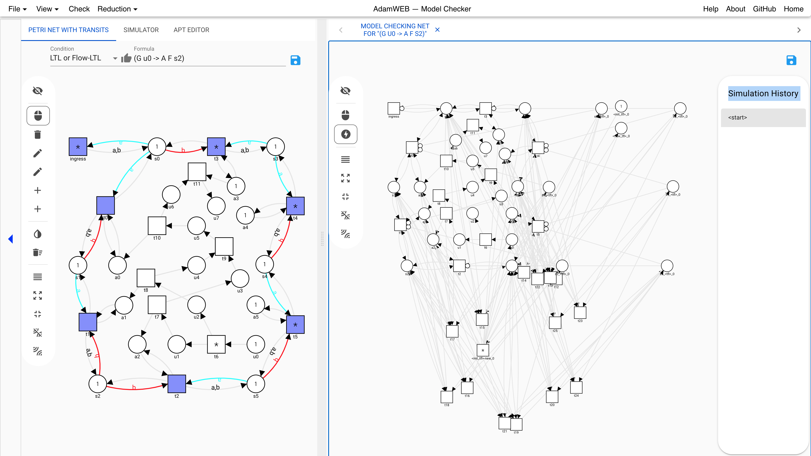
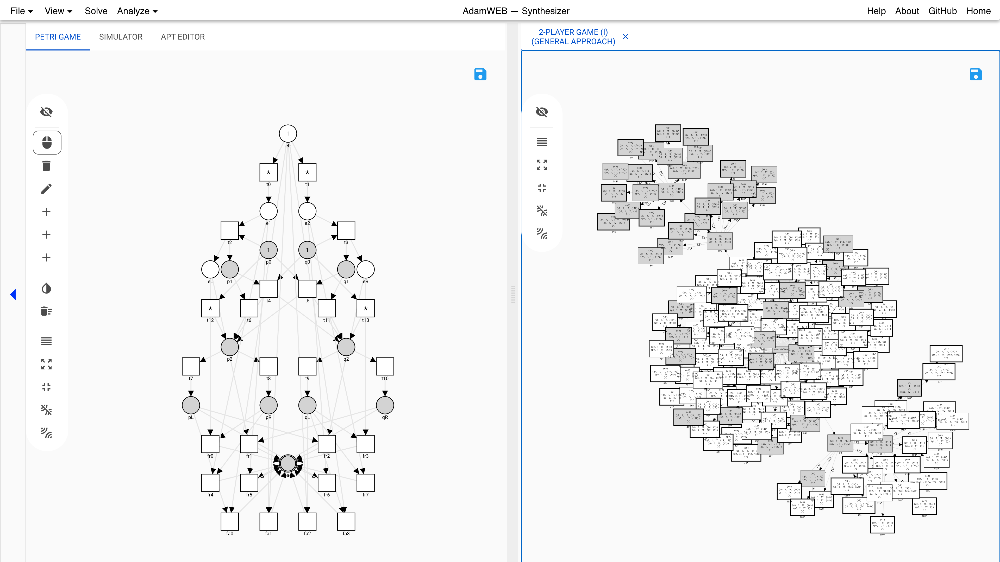

A Web Interface for the Model Checking and Synthesis of Distributed Systems with Data Flows
===========================================================================================
This is the web interface for the command-line tools [AdamMC](https://github.com/adamtool/adammc) and [AdamSYNT](https://github.com/adamtool/adamsynt).

- AdamMC is a model checker for asynchronous distributed systems modeled with Petri nets with transits and specifications given in Flow-LTL.
- AdamSYNT is a synthesizer for asynchronous distributed systems modeled with Petri games.

Features:
---------
- AdamMC:
	- Modeling, visualization, and simulation of Petri nets with transits
	- Model checking of Petri nets with transits against Flow-LTL
	- Model checking of 1-bounded Petri nets against LTL with places and transitions as atomic propositions
	- Visualization and simulation of counter examples
	- **Documentation**: https://github.com/adamtool/webinterface/tree/master/doc/mc
	- 
- AdamSYNT:
	- Modeling, visualization, and simulation of Petri games
	- Synthesis of Petri games with one environment player and a bounded number of system players with a local safety objective
	- Interactive visualization of the corresponding two-player game to aid in finding modeling bugs
	- Visualization and simulation of the strategies
	- **Documentation**: https://github.com/adamtool/webinterface/tree/master/doc/synt    
	- 

Dependencies:
-------------
This module depends on the 
- the repository as submodules: [libs](https://github.com/adamtool/libs), [examples](https://github.com/adamtool/examples), [framework](https://github.com/adamtool/framework), [logics](https://github.com/adamtool/logics), [modelchecker](https://github.com/adamtool/modelchecker), [synthesizer](https://github.com/adamtool/synthesizer), [high-level](https://github.com/adamtool/high-level), [webinterface-backend](https://github.com/adamtool/webinterface-backend).
- the external tools: [McHyper](https://github.com/reactive-systems/MCHyper), [AigerTools](http://fmv.jku.at/aiger/), [ABC](https://people.eecs.berkeley.edu/~alanmi/abc/).

Related Publications:
---------------------
- AdamMC:
	- **Flow-LTL**: _Bernd Finkbeiner, Manuel Gieseking, Jesko Hecking-Harbusch, Ernst-Rüdiger Olderog:_
  [Model Checking Data Flows in Concurrent Network Updates](https://doi.org/10.1007/978-3-030-31784-3_30). ATVA 2019: 515-533 [(Full Version)](http://arxiv.org/abs/1907.11061).
  	- **Flow-CTL**: _Bernd Finkbeiner, Manuel Gieseking, Jesko Hecking-Harbusch, Ernst-Rüdiger Olderog:_
  [Model Checking Branching Properties on Petri Nets with Transits](
https://doi.org/10.1007/978-3-030-59152-6_22). ATVA 2020: 394-410 [(Full Version)](https://arxiv.org/abs/2007.07235).
	- **Tool AdamMC**: _Bernd Finkbeiner, Manuel Gieseking, Jesko Hecking-Harbusch, Ernst-Rüdiger Olderog:_
  [AdamMC: A Model Checker for Petri Nets with Transits against Flow-LTL](https://doi.org/10.1007/978-3-030-53291-8_5). CAV (2) 2020: 64-76 [(Full Version)](https://arxiv.org/abs/2005.07130).
 - AdamSYNT:
 	- **Theoretical Background**: _Bernd Finkbeiner, Ernst-Rüdiger Olderog:_
  [Petri games: Synthesis of distributed systems with causal memory](https://doi.org/10.1016/j.ic.2016.07.006). Inf. Comput. 253: 181-203 (2017)
  	- **Tool AdamSYNT**: _Bernd Finkbeiner, Manuel Gieseking, Ernst-Rüdiger Olderog:_
  [Adam: Causality-Based Synthesis of Distributed Systems](https://doi.org/10.1007/978-3-319-21690-4_25). CAV (1) 2015: 433-439
	- _Bernd Finkbeiner, Manuel Gieseking, Jesko Hecking-Harbusch, Ernst-Rüdiger Olderog:_
  [Symbolic vs. Bounded Synthesis for Petri Games](https://doi.org/10.4204/EPTCS.260.5). SYNT@CAV 2017: 23-43


How To Build and Run:
---------------------
If you have not cloned the repository with the ```--recursive``` flag, please first use
```
git submodule update --init
```
to get all the code of the backend.

To **compile** the web interface please use the script
```
./buildWithBackend.sh
```
This also generates the corresponding backend jar file of Adam and integrates it. All other dependencies are downloaded
by maven. This could take a while. For more details regarding the backend, e.g., how to update to a newer version, please see the [ReadMe](./backend/README.md) of the backend.

To **start** the web interface please use the script
```
./run.sh
```
and open 
```localhost:4567```
in your browser.

All temporary files created by the web interface or external tools are stored by default in folder ```./tmp/``` in the server's working directory. This location can be overridden using the command line flag ```-DADAMWEB_TEMP_DIRECTORY=/path/to/store/temporary/files/```.


For model checking to work, you have to have the tools abc, aiger and mchyper, as well as GNU 'time', installed on your system and update the file ADAM.properties to have the correct paths to each one. The source code of each one is in a .tar.gz or a .zip file in this repository.  The README for mchyper explains how to compile them.


