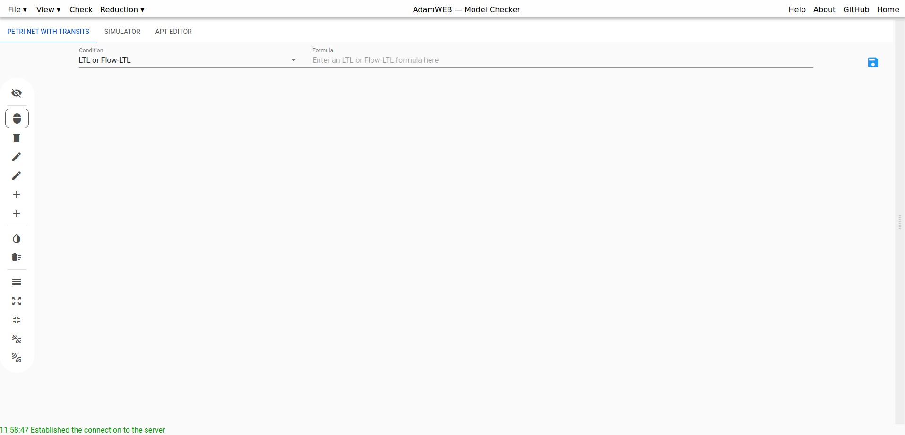
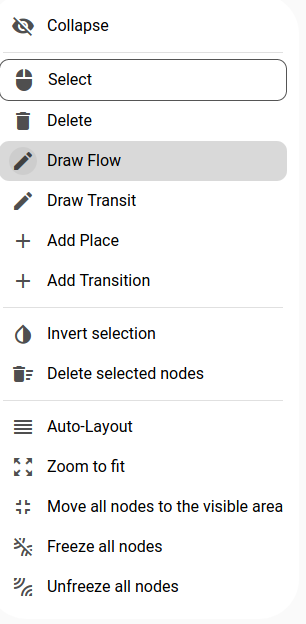

User's Guide to the Web Interface (Model Checking)
==================================================

With this user's guide we want to give on overview of some common workflows of the web interface corresponding to AdamMC.

Create a New Petri Net with Transits
====================================
When entering the interface for the model checking approach you get the following picture 

