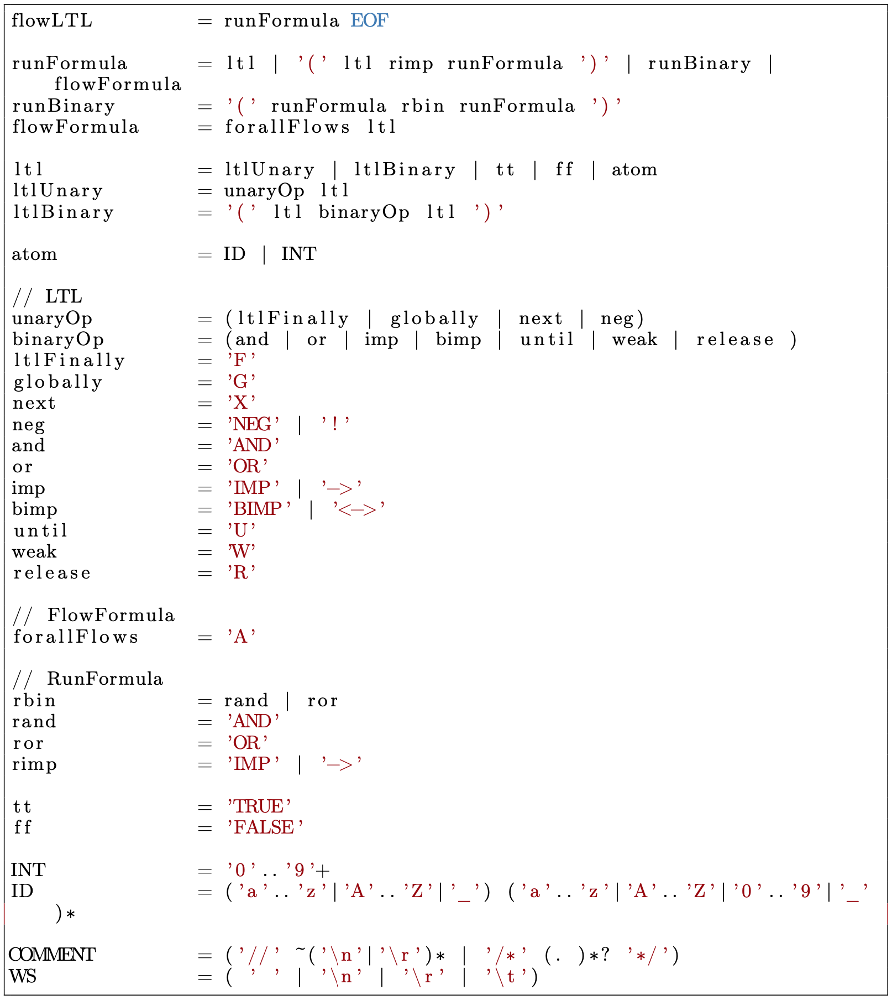

User's Guide to the Web Interface (Model Checking)
==================================================
With this user's guide we want to give on overview of some common workflows of the web interface corresponding to AdamMC.

General Items:
--------------
When entering the interface for the model checking approach you get the following picture:

At the top of the screen you have a menu bar where you have the items

- **File**
  * **New Petri net with transits** - to clear the old Petri net with transits and create a new fresh one.
  * **Load APT from file** - to load a file from your disk in the APT format (see **todo** format description section)
  * **Save APT to file** - saves the current Petri net with transits to your disk in the APT format (see **todo** format description section)
  * **Load example** - lets you choose some of the provided example Petri nets with transits of the server
- **View**
  * **Log Window** - shows a logging window for debugging information for the advanced user
  * **Job Queue** - shows a panel with the recent jobs and results of the user and the possibility to load the results back into the interface, or delete or cancel them. Note that only the text and not the colored layer is clickable. You can even exchange your unique identifier of the browser to show others your job list, results, and problems.

  * **Show right panel** - expands or collapses the right panel which is shown when having any results created. This can also be done with the slider, which can be used to customize the sizes of the panel
  * **Show physics controls** - this adds the following slider to the bottom of the side

Here the behavior of the physics control for the nodes of the visualized objects, i.e., the Petri net with transits or the constructed Petri net, can be customized. When the nodes are unfreezed (see **todo** section create Petri net with Transits) the nodes can freely move over the panel. To created clearer views and to minimize the overlapping the *Repulsion Strength*, the *Link strength*, and the *Gravity strength* can be modified.
  * **Show node labels instead of IDs** - Most of the nodes of the  constructed Petri net for the reduction methods for checking Petri nets with transits against Flow-LTL have a correspondence to the input Petri net with transits. With this button you can toggle between showing the names of corresponding nodes or the original ones.
- **Check** - this starts the model checking procedure and results in opening a tab to the right showing the answer whether the input Petri net with transit satisfies the Flow-LTL formula formula. If it is not satisfied a counter example is given.
- **Reduction**
  * **Petri net** - this creates the constructed *Petri net* for the reduction method from the given input Petri net with transits and Flow-LTL formula and shows it in the right panel.
  * **LTL formula** - this created the constructed *LTL formula* for the reduction method from the given input Petri net with transits and Flow-LTL formula and shows it in the right panel.

The items to the right gives you the following features

- **Help** - opens a help dialog with some short cuts and the syntax of the Flow-LTL formulas
- **About** - opens a dialog with some information about this approach
- **GitHub** - opens the source code for the web interface on GitHub
- **Home** - leads you back to the index page to choose between the model checking and the distributed synthesis approach

Create a New Petri Net with Transits
------------------------------------
To model your own Petri net with transits the menu bar to the left can be used.

Here the following features are available

- **Collapse** - Collapses the menu bar to make more space for the actual drawing panel, or expands it again
- **Select** - Changes to the mode that a single node can be selected by clicking the node or several nodes can be selected by holding the ctrl-key while clicking the next node. In general clicking and holding the left button down in a free area allows you to create a rectangle which selects all the inner nodes.
- **Delete** - Changes to the mode that clicking a node or an arc deletes the node or the arc.
- **Draw Flow** - Changes to the mode to draw the control flows (the black arcs) between the nodes. Clicking on a node, and holding the left mouse button allows you to move the visualized arc to the desired successor node. Note that only arcs between places and transitions are allowed.
- **Draw Transit** - Changes to the mode to draw transits (the colored and/or labeled arcs) between the nodes. First you click the place where the transit should start, second the transition used for the transit, and third as many successor places as you want to connect with the data flow. Hitting *enter* ends the selection. For creating initial transits, the first node can already be the transition. Note that a control flow is added between the nodes when none is existing.
- **Add Place** - Changes to the mode that each click creates a new place at this position.
- **Add Transition** - Changes to the mode that each click creates a new transition at this position. 
- **Invert selection** - Inverts the current selection.
- **Delete selected nodes** - Deselects all currently selected nodes.
- **Auto-Layout** - Each click creates a new random automatic layout of the nodes.
- **Zoom to fit** - Zooms into or out of the panel such that all nodes are visible in the cutout.
- **Move all nodes to the visible area** - Changes the position of the nodes out of the current cutout of the panel, such that they fit into the current cutout.
- **Freeze all nodes** - With an active physics control this stops the moving of the nodes.
- **Unfreeze all nodes** - This starts again the physics control and deletes all current coordinates of the nodes.

**Drag and drop** can be used to move the **nodes** (when clicking the nodes) and the **panel** when clicking into the free space and holding the *shift-key*. Dragging a node with a pressed *ctrl-key* **snaps** the node **to a grid**. **Zoom in and out** can be done with the mouse wheel. **Enabled transitions** are visualized with an asterisk *.

Clicking a node with the right mouse button opens a context menu for the node which shows the name in the first line and the label in square brackets in the second. The options for the nodes are:

- Place
  * **Delete** - deletes the node
  * **Rename** - allows to enter a new name
  * **Set initial token** -  allows to enter a number of initial token. Note that the current approach only allows for model checking safe, i.e. 1-bounded, Petri nets with transits.
- Transition
  * **Delete** - deletes the node
  * **Rename** - allows to enter a new name
  * **Set weak fair** - marks this transition as *weak* fair (only visible if not already weak fair)
  * **Set strong fair** - marks this transition as *strong* fair (only visible if not already strong fair)
  * **Remove fairness** - removes the fairness constraint from this transition (only visible if the transition is marked as weak or strong fair)
- Flow
  * **Delete Flow** - deletes the flow
  * **Set inhibitor arc** - marks the flow as an inhibitor arc (only visible for ingoing arcs from transitions, which are not already inhibitor arcs). Inhibitor arcs are visualized by a circle at the end of the arc instead of the arrow head.
  * **Set not inhibitor arc** - removes the inhibitor marker of a flow (only visible for inhibitor arcs) 

Syntax Flow-LTL:
----------------

Model Checking Petri Nets with Transits:
----------------------------------------
