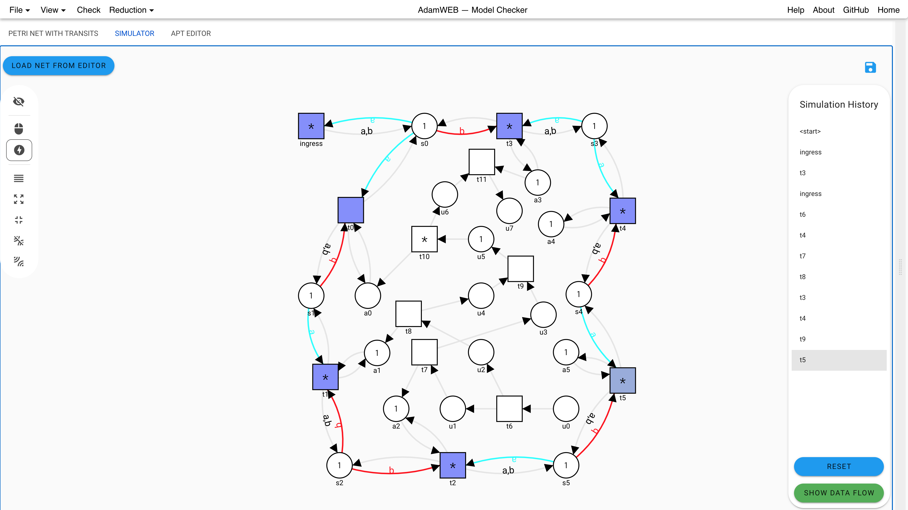
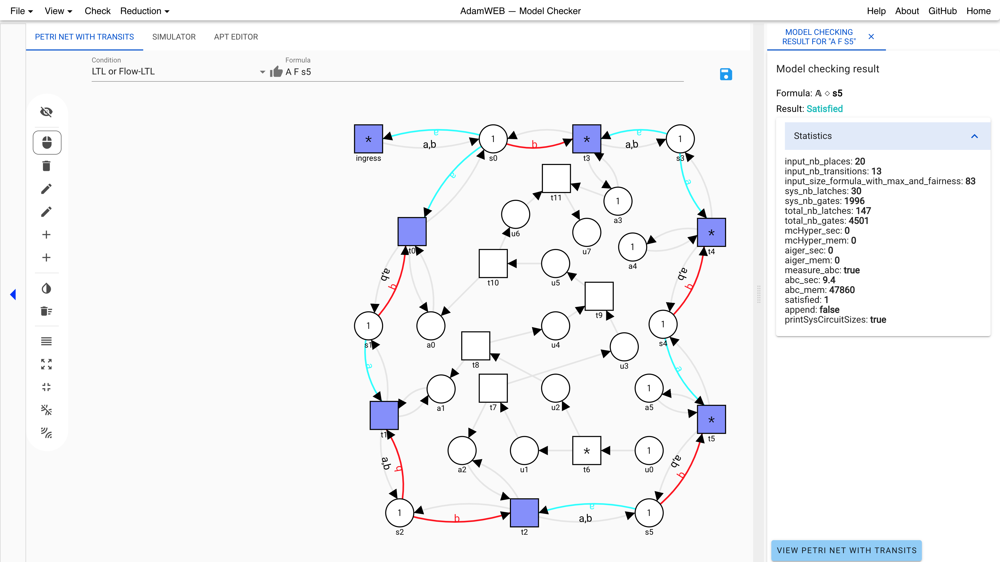

User's Guide to the Web Interface (Model Checking)
==================================================
With this user's guide we want to give on overview of some common workflows of the web interface corresponding to AdamMC.

- [General Items](#GeneralItems)
- [Create a new Petri net with transits](#CreateANewPetriNetWithTransits)
- [Simulating a Petri net with transits](#SimulatingAPetriNetWithTransits)
- [Syntax Flow-LTL](#syntaxFlowLTL)
- [Model checking Petri nets with transits](#ModelCheckingPetriNetswithTransits)
- [Reduction](#reduction)

General Items:
--------------
<a name="GeneralItems"></a> 
When entering the interface for the model checking approach you get the following picture:


At the top of the screen you have a menu bar where you have the items

- **File**
  * **New Petri net with transits** - to clear the old Petri net with transits and create a new fresh one.
  * **Load APT from file** - to load a file from your disk in the APT format (see **todo** format description section)
  * **Save APT to file** - saves the current Petri net with transits to your disk in the APT format (see **todo** format description section)
  * **Load example** - lets you choose some of the provided example Petri nets with transits of the server
- **View**
  * **Log Window** - shows a logging window for debugging information for the advanced user
  * **Job Queue** - shows a panel with the recent jobs and results of the user and the possibility to load the results back into the interface, or delete or cancel them. Note that only the text and not the colored layer is clickable. You can even exchange your unique identifier of the browser to show others your job list, results, and problems.

  * **Show right panel** - expands or collapses the right panel which is shown when having any results created. This can also be done with the slider, which can be used to customize the sizes of the panel
  * **Show physics controls** - this adds the following slider to the bottom of the side

Here the behavior of the physics control for the nodes of the visualized objects, i.e., the Petri net with transits or the constructed Petri net, can be customized. When the nodes are unfreezed (see [here](#unfreeze)) the nodes can freely move over the panel. To created clearer views and to minimize the overlapping the *Repulsion Strength*, the *Link strength*, and the *Gravity strength* can be modified.
  * **Show node labels instead of IDs** - Most of the nodes of the  constructed Petri net for the reduction methods for checking Petri nets with transits against Flow-LTL have a correspondence to the input Petri net with transits. With this button you can toggle between showing the names of corresponding nodes or the original ones.
- **Check** - this starts the model checking procedure and results in opening a tab to the right showing the answer whether the input Petri net with transit satisfies the Flow-LTL formula formula. If it is not satisfied a counter example is given.
- **Reduction**
  * **Petri net** - this creates the constructed *Petri net* for the reduction method from the given input Petri net with transits and Flow-LTL formula and shows it in the right panel.
  * **LTL formula** - this created the constructed *LTL formula* for the reduction method from the given input Petri net with transits and Flow-LTL formula and shows it in the right panel.

The items to the right gives you the following features

- **Help** - opens a help dialog with some short cuts and the syntax of the Flow-LTL formulas
- **About** - opens a dialog with some information about this approach
- **GitHub** - opens the source code for the web interface on GitHub
- **Home** - leads you back to the index page to choose between the model checking and the distributed synthesis approach

Create a New Petri Net with Transits
------------------------------------
<a name="CreateANewPetriNetWithTransits"></a>
To model your own Petri net with transits the menu bar to the left can be used.


Here the following features are available
<a name="leftMenu"></a>

- **Collapse** - Collapses the menu bar to make more space for the actual drawing panel, or expands it again
- **Select** - Changes to the mode that a single node can be selected by clicking the node or several nodes can be selected by holding the ctrl-key while clicking the next node. In general clicking and holding the left button down in a free area allows you to create a rectangle which selects all the inner nodes.
- **Delete** - Changes to the mode that clicking a node or an arc deletes the node or the arc.
- **Draw Flow** - Changes to the mode to draw the control flows (the black arcs) between the nodes. Clicking on a node, and holding the left mouse button allows you to move the visualized arc to the desired successor node. Note that only arcs between places and transitions are allowed.
- **Draw Transit** - Changes to the mode to draw transits (the colored and/or labeled arcs) between the nodes. First you click the place where the transit should start, second the transition used for the transit, and third as many successor places as you want to connect with the data flow. Hitting *enter* ends the selection. For creating initial transits, the first node can already be the transition. Note that a control flow is added between the nodes when none is existing.
- **Add Place** - Changes to the mode that each click creates a new place at this position.
- **Add Transition** - Changes to the mode that each click creates a new transition at this position. 
- **Invert selection** - Inverts the current selection.
- **Delete selected nodes** - Deselects all currently selected nodes.
- **Auto-Layout** - Each click creates a new random automatic layout of the nodes.
- **Zoom to fit** - Zooms into or out of the panel such that all nodes are visible in the cutout.
- **Move all nodes to the visible area** - Changes the position of the nodes out of the current cutout of the panel, such that they fit into the current cutout.
- **Freeze all nodes** - With an active physics control this stops the moving of the nodes.
- **Unfreeze all nodes** - This starts again the physics control and deletes all current coordinates of the nodes.<a name="unfreeze"></a> 

**Drag and drop** can be used to move the **nodes** (when clicking the nodes) and the **panel** when clicking into the free space and holding the *shift-key*. Dragging a node with a pressed *ctrl-key* **snaps** the node **to a grid**. **Zoom in and out** can be done with the mouse wheel. **Enabled transitions** are visualized with an asterisk *.

Clicking a node with the right mouse button opens a context menu for the node which shows the name in the first line and the label in square brackets in the second. The options for the nodes are:

- Place
  * **Delete** - deletes the node
  * **Rename** - allows to enter a new name
  * **Set initial token** -  allows to enter a number of initial token. Note that the current approach only allows for model checking safe, i.e. 1-bounded, Petri nets with transits.
  * **Toggle is special** - allows to mark this place as special. This is used to automatically generate the Flow-LTL formulas for a Büchi, reachability, and safety condition (only visible if the Büchi, Reachability, or Safety condition is selected in the drop down menu left to the formula field).
- Transition
  * **Delete** - deletes the node
  * **Rename** - allows to enter a new name
  * **Set weak fair** - marks this transition as *weak* fair (only visible if not already weak fair)
  * **Set strong fair** - marks this transition as *strong* fair (only visible if not already strong fair)
  * **Remove fairness** - removes the fairness constraint from this transition (only visible if the transition is marked as weak or strong fair)
- Flow
  * **Delete Flow** - deletes the flow
  * **Set inhibitor arc** - marks the flow as an inhibitor arc (only visible for ingoing arcs from transitions, which are not already inhibitor arcs). Inhibitor arcs are visualized by a circle at the end of the arc instead of the arrow head.
  * **Set not inhibitor arc** - removes the inhibitor marker of a flow (only visible for inhibitor arcs) 

Simulating a Petri Net with Transits:
-------------------------------------
Clicking on the **SIMULATOR** tab allows to fire enabled transitions (indicated by the asterisk *) in the Petri net with transits:



When the **thunderbolt** item of the left menu bar is activated, the transitions are clickable and a visual feedback (flashing green or red) is provided whether the transition has fired or not. To the right the list of fired transition is remembered in the **Simulating History** panel. By clicking the transitions in the history, the Petri net with transits is set back or forth to the corresponding state. Note that many examples have transitions which take token but also but them back to the same place. This may look like nothing has changed. The button **RESET** removes all transitions from the history. The button **SHOW DATA FLOW** generates a PDF showing all data flow trees corresponding to the giving firing sequence. Note that real tree behavior is only achieved if at least one transition with branching behavior transiting an existing data flow occur in the firing sequence.

The other items of the **left menu** belong to the layout of the nodes. See [here](#leftMenu) for the explanations. This layout does not change anything for the input Petri net with transits. The simulated net stays in the state even if the tab is hidden. It only changes when loading a new net by the **LOAD NET FROM EDITOR** button or with loading the counter examples (see [here](#ModelCheckingPetriNetswithTransits)).

Syntax Flow-LTL:
----------------
<a name="syntaxFlowLTL"></a> 
Flow-LTL contains of two different kind of formulas. The *run formulas* for the control part and the *flow formulas* for the data part.
In both standard LTL can be used with the following operators:

| LTL         | Syntax      |
| ----------- | ----------- |
| true     | TRUE    |
| false    | FALSE    |
| atoms     | place and transition ids    |
| Negation    | NEG or !    |
| Next    | X   |
| Conjunction | AND         |
| Disjunction | OR         |
| Implication | IMP or ->         |
| Bimplication| BIMP or <->         |
| Until | U         |
| Weak Until | W         |
| Release | R         |

Binary operators have to be in brackets, unary operators not. For example (!phi0 -> (phi1 AND G F phi2)). Note that the ids for the places and transitions are more restricted for the formula as for the web interface. For the restrictions please see the detailed syntax below.

The start of a **flow formula** is indicated by the operator 'A'.

For a **Flow-LTL formula** phi we allow the syntax

```
phi = LTL | (phi AND phi) | (phi OR phi) | (LTL -> phi) | A LTL
```

The following picture shows the parser's grammar for Flow-LTL:


Model Checking Petri Nets with Transits:
----------------------------------------
<a name="ModelCheckingPetriNetswithTransits"></a>
To model check a Petri net with transits against Flow-LTL a Flow-LTL formula have to be available in the input field:


With the drop down menu you can select to either input an own **Flow-LTL formula**, or the select **Büchi**, **Reachability**, or **Safety** as condition. The latter uses the in this mode as special selected places to generate a Flow-LTL formula. The syntax for the Flow-LTL formula can be seen [here](#syntaxFlowLTL). Note that the fairness assumptions of the transitions are automatically added while checking the formula and the interleaving maximality assumption is added. This means we only consider runs which satisfy that whenever a transition is enabled, some transition fires.

Clicking the **Check** item of the top menu bar creates a new tab to the left and starts the model checking procedure. For a **satisfying** Flow-LTL formula the result looks like this:



The slider splitting the left and the right panel can be used to customize the panel sizes. The result and the checked formula is given, and some statistically insides of this model checking run can be shown.

In the negative case, i.e., the formula is **not satisfied**, the picture looks like this:


Again the formula and the result is printed, but in addition to that a **counter example** as a firing sequence which violates the formula is given. When clicking **LOAD INTO SIMULATOR** this firing sequence can be given to the simulator (see [here](#simulator)). Furthermore, with **SHOW WITNESSES** you can create a PDF showing the witnesses regarding all flow subformulas for this counter example. This PDF shows the firing sequence of the control and connected to that the violating flow chain for each flow subformula:


The model checking procedure for model checking Petri nets with transits against Flow-LTL is based on a reduction to model checking Petri net against LTL (see [here](#reduction)). A **counter example** for this **constructed Petri net** is also given and can be loaded into the simulator with the corresponding Petri net. The technical details regarding the latches of the circuit can be seen when clicking on the counter example for the constructed Petri net.

Reduction:
----------
<a name="Reduction"></a>


