User Guide to the Web Interface (Distributed Synthesis)
========================================================

With this user guide, we give an overview of some common workflows of the web interface for AdamSYNT.

- [General Items](#GeneralItems)
- [Create a Petri game](#CreateAPetriGame)
- [Simulate a Petri game](#SimulatingAPetriGame)
- [Synthesis of Distributed Systems with Petri Games](#SynthesisOfDistributedSystemsWithPetriGames)
- [Reduction from Petri games to Two-Player Games over Finite Graphs](#reduction)
- [Text Editor](#textEditor)
- [Common Error Messages](#commonProblems)

General Items:
--------------
When opening the interface for the synthesis of distributed systems approach in your browser, you get the following picture:
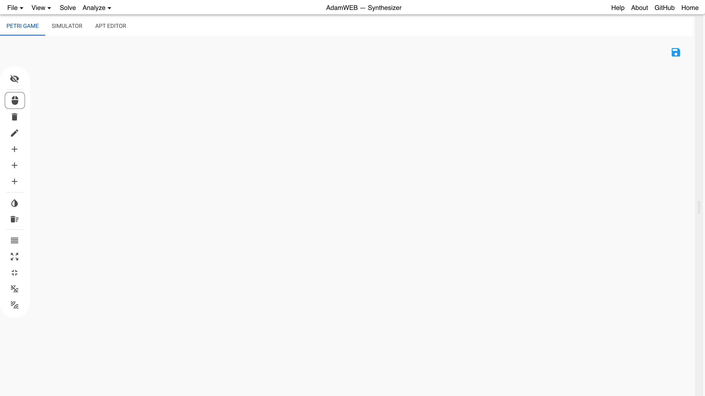

At the top of the screen, there is a menu bar with the following items:

- **File**
  * **New Petri game** - clears the old Petri game and create a new one.
  * **Load APT from file** - loads a file from your disk in the APT format (see [here](https://uol.de/f/2/dept/informatik/ag/csd/adam/Format.pdf) for a format description).
  * **Save APT to file** - saves the current Petri net with transits to your disk in the APT format (see [here](https://uol.de/f/2/dept/informatik/ag/csd/adam/Format.pdf) for a format description).
  * **Load example** - loads one of the provided example Petri games.
- **View**
  * **Log Window** -shows a logging window with debugging information for advanced users.
  * **Job Queue** - shows a panel with the recent jobs and results of the user and the possibility to load the results back into the interface, or to delete or cancel them. Note that only the text and not the colored layer is clickable. You can exchange your unique identifier of the browser to show others your job list, results, and problems.
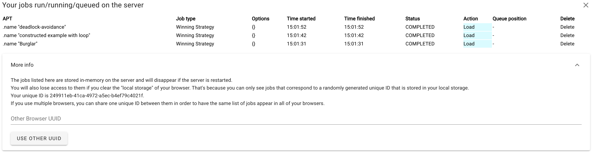
  * **Show right panel** - expands or collapses the right panel which is shown after a result is obtained. This can also be done with the slider, which can be used to customize the sizes of the panel.
  * **Show physics controls** - adds the following slider to the bottom of the screen.

Here, the behavior of the physics control for the nodes of the visualized objects, i.e., the input Petri game, the strategy, the two-player game, and the two-player strategy, can be customized. When the nodes are unfreezed (see [here](#unfreeze)), the nodes can freely move in the panel. To minimize overlapping, the *Repulsion Strength*, the *Link strength*, and the *Gravity strength* can be modified.
  * **Show partitions** - To use faster algorithms, places can be annotated with partition ids (see [here](#partitions)). With this item, the visualization of the partitions can be toggled on and off.
  * **Show node labels instead of IDs** - The nodes of the strategy for the Petri game correspond to the nodes of the Petri game. With this button, you can toggle between showing the names of nodes or the original names as labels.
- **Solve** - starts the distributed synthesis procedure and afterward opens a tab on the right showing either a deadlock-avoiding winning strategy or that no such strategy exists.
- **Analyze**
  * **Exists winning strategy** - opens a new tap on the right with the answer whether a strategy for the input Petri game exists or not.
  * **2-Player Strategy** - opens a new tap on the right showing either the winning strategy of the two-player game corresponding to the input Petri game or that no such strategy exists (see the [reduction section](#reduction)).
  * **2-Player game (complete)** - creates the two-player game for the given Petri game (see the [reduction section](#reduction)). This method creates the complete graph and is expensive due to the huge state-space of most examples.
  * **2-Player game (incremental)** - creates the two-player game for the given Petri game (see the [reduction section](#reduction)). This method creates the state-space incrementally by only calculating the next successor states for clicked states. Two approaches are available:
	* **Explicit approach** - Only cases are considered where in every infinite sequence of transitions there are infinitely many transitions involving the environment. This allows for a faster calculation and clearer view, but only considers this subclass of Petri games (no type-2 case existent).
   * **General approach** - Due to the usage of BDDs, the calculation of especially the first successor state can take longer. This method is complete.

The items to the right give you the following features:

- **Help** - opens a help dialog with some shortcuts and a link to this user guide.
- **About** - opens a dialog with some information about the web interface.
- **GitHub** - opens the source code for the web interface on GitHub.
- **Home** - leads you back to the index page to choose between the model checking and the distributed synthesis approach.

Create a Petri Game:
--------------------
To model a Petri game, the menu bar on the left is used:

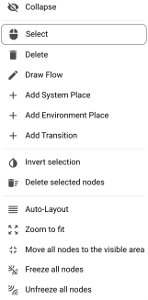

Here, the following features are available:

- **Collapse** - collapses the menu bar to make more space for the actual drawing panel, or expands it again.
- **Select** - changes to the mode where a single node can be selected by clicking the node or several nodes can be selected by holding the ctrl-key while clicking the next node. Clicking and holding the left mouse button in a free area creates a rectangle which selects all nodes in the rectangle.
- **Delete** - changes to the mode where clicking a node or an arc deletes the node or the arc.
- **Draw Flow** - changes to the mode to draw the flow (the black arcs) between the nodes. Clicking and holding the left mouse button on a node allows you to move the visualized arc to the desired successor node. Note that only arcs between places and transitions are allowed.
- **Add System Place** - changes to the mode where each click creates a new system place (gray circle) at this position.
- **Add Environment Place** - changes to the mode where each click creates a new environment place (white circle) at this position.
- **Add Transition** - changes to the mode where each click creates a new transition (white square) at this position.
- **Invert selection** - inverts the current selection.
- **Delete selected nodes** - deselects all currently selected nodes.
- **Auto-Layout** - creates a new random automatic layout of the nodes.
- **Zoom to fit** - zooms into or out of the panel such that all nodes are visible.
- **Move all nodes to the visible area** - changes the position of the invisible nodes of the current cutout of the panel such that they fit into the current cutout.
- **Freeze all nodes** - deactivates the physics control and the movability of all nodes.

- **Unfreeze all nodes** - reactivates the physics control, deletes the current coordinates of all nodes, and reactivates the movability of all nodes.

**Drag and drop** can be used to move the **nodes** (when clicking the nodes) and the **panel** when clicking into the free space and holding the *shift-key*. Dragging a node with a pressed *ctrl-key* **snaps** the node **to a grid**. **Zoom in and out** can be done with the mouse wheel. **Enabled transitions** are visualized with an asterisk *.

**Clicking a node** with the **right mouse button** opens a context menu for the node which shows the name in the first line and the label in square brackets in the second. The options for the nodes are:

- Place
  * **Delete** - deletes the node.
  * **Rename** - allows to enter a new name.
  * **Change to environment place** - changes this place to an environment place (white circle). Only visible if it is currently a system place.
  * **Change to system place** - changes this place to a system place (gray circle). Only visible if it is currently an environment place.
  
  * **Set partition** -  allows to enter a number to which partition this place belongs. Environment token are automatically added to partition 0. When no automatic partitioning is possible (getting a corresponding message when trying to solve a game without annotated partitions), the user has to annotate the places manually. The places have to be partitioned into disjunctive sets such that in each reachable marking no two places of the same partition occur. Thus, you should partition the places with regard to the tokens that can reside in the place. The less partitions you use the faster the algorithms work.
  * **Set initial token** -  allows to enter a number of initial tokens. Note that the current approach only allows for the synthesis of safe, i.e., 1-bounded Petri games.
  * **Toggle is special** - allows to mark or unmark this place as a **bad** place.
- Transition
  * **Delete** - deletes the node.
  * **Rename** - allows to enter a new name.
- Flow
  * **Delete Flow** - deletes the flow.

Simulate a Petri game:
----------------------
Clicking on the **SIMULATOR** tab allows to fire enabled transitions (indicated by the asterisk *) in the Petri game:

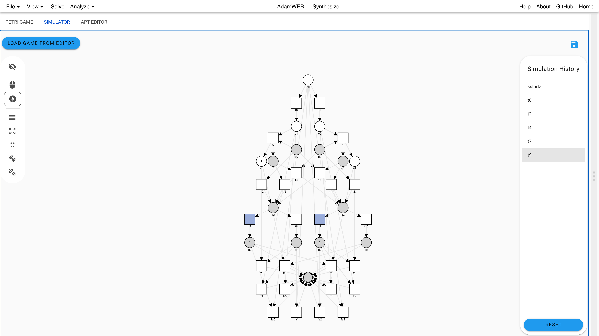

When the **thunderbolt** item of the left menu bar is chosen, transitions are clickable and a visual feedback (flashing green or red) is provided whether the transition has fired or not. On the right, the list of fired transition is remembered in the **Simulating History** panel. By clicking the transitions in the history, the Petri game is set back or forth to the corresponding state. The button **RESET** removes all transitions from the history.

The other items of the **left menu** belong to the layout of the nodes. See [here](#leftMenu) for the explanations. This layout does not change anything for the input Petri game. The simulated game stays in the state even if the tab is hidden. It only changes when loading a new game by the **LOAD GAME FROM EDITOR** button.

Synthesis of Distributed Systems with Petri Games:
--------------------------------------------------
To synthesize local controllers for the input Petri game, you click **Solve** from the top menu bar. This results in opening a new tab which either shows a deadlock-avoiding winning strategy or a message that no such strategy exists.

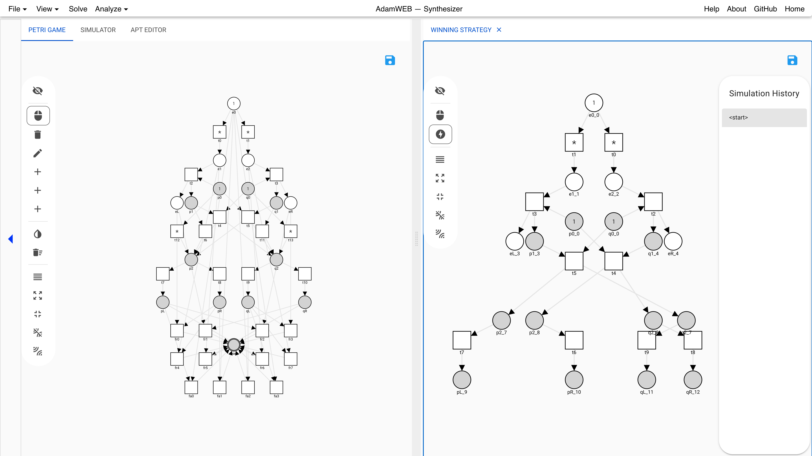

For a positive result, the strategy can be **simulated** as described [here](#SimulatingAPetriGame). The strategy can be **saved** as SVG, APT, or PNML by clicking on the **floppy disk** symbol. In case of the PNML export, only the underlying Petri net is exported without the game semantics.

For the realizability problem, i.e., to only check whether a strategy exists, the item **Exists Winning Strategy** under the main menu bar item **Analyze** can be used. This opens a tab with the respective answer:
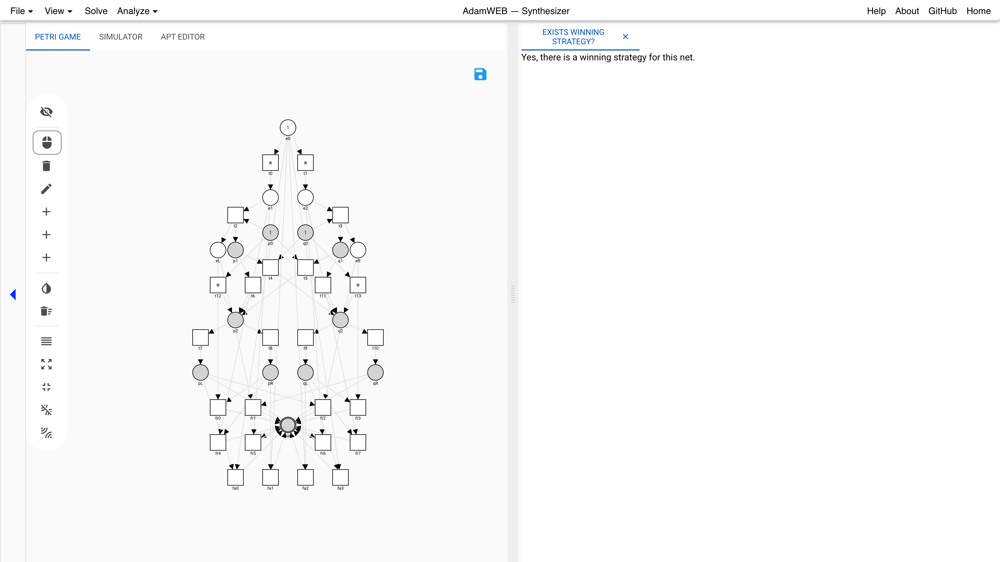

Reduction from Petri games to Two-Player Games over Finite Graphs:
------------------------------------------------------------------
In the background, the synthesis problem for Petri games is reduced to the synthesis problem for a two-player game over a finite graph with complete information. Insides about this reduction can be obtained by using the items 2-Player Strategy, 2-Player game (complete), and 2-Player game (incremental) of the main menu bar under item **Analyze**. When using **2-Player Strategy**, a tab is opened which either shows the two-player strategy, which can be arranged and saved as an SVG, or the message that there is no strategy existent.
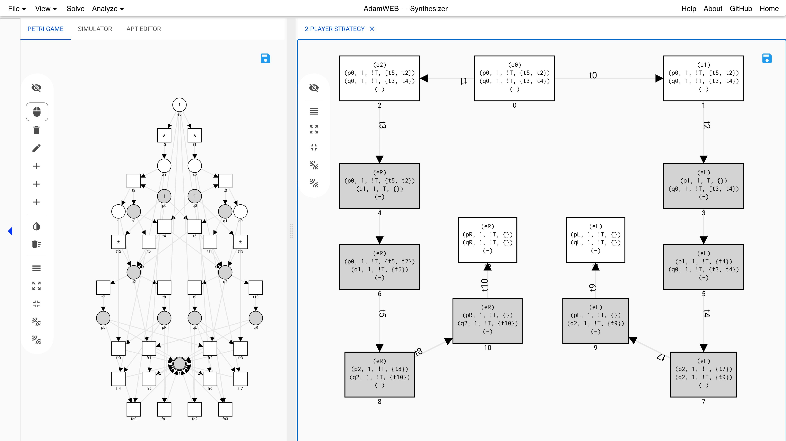
When there is no strategy but the user expects that a strategy should exist, the web interface allows to create the complete two-player game with the item **2-Player game (complete)**. A new tab opens and the user can unfold the successors of a state by left clicking a node with an asterisk * to the right of the ID and the predecessors by right clicking the node when there is an asterisk * to the left of the ID. Left clicking an unfolded node, folds the successors back in.
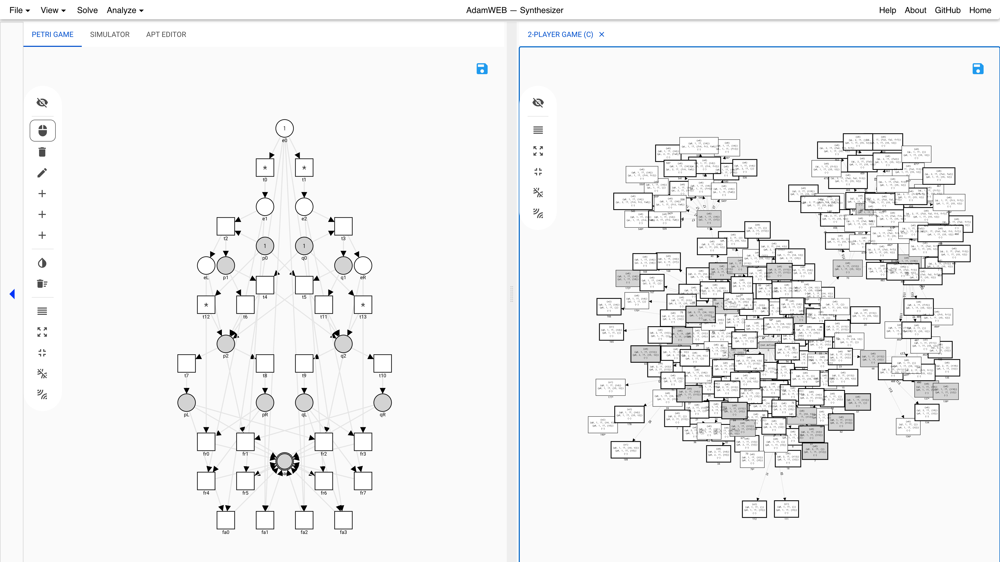
The user can create the expected strategy step-by-step, by unfolding the successors, moving the expected node (or nodes for an environment state) out of the bunch of nodes, and repeating these steps. Adapting the physics control settings, zooming, and moving the panel may also help to get a clearer view. This  helps to find the cause of the unexpected behavior because all bad states are marked with a bold black border.

This approach can be expensive due to the possibly large state-space of the system. To alleviate the problem, there is the option to calculate only the by the user desired parts of the two-player game. When clicking **2-Player game (incremental)** a new tab opens showing two possible approaches.
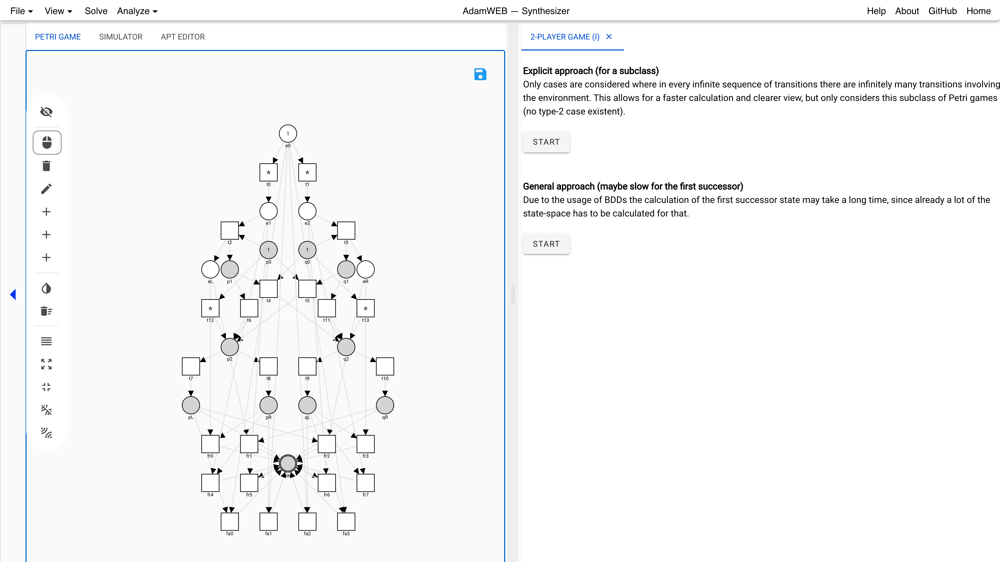

The first approach further improves the size and the clarity of the presentation by only considering a subclass of Petri games. Only cases are considered where in every infinite sequence of transitions there are infinitely many transitions involving the environment. This means no type-2 case, i.e., situations where the system players can play infinitely long without any interaction with the environment, is existent. The user can first leave out these situations, since those cases do not have to react on the nondeterministic environment and therefore can be decided easily.
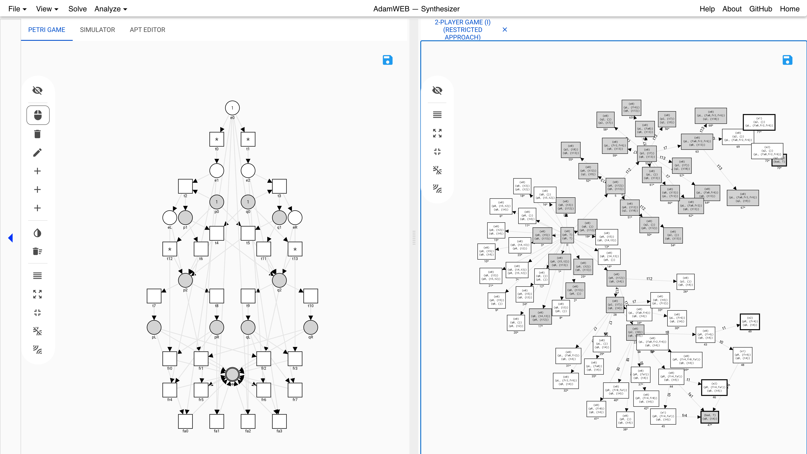
Here, only the left click on nodes for calculating and showing all successors and the folding of unfolded nodes is available.

The general approach takes the type-2 case into account. Due to calculating the successors with BDDs, the calculation of the first successors can take longer.

The usage is the same as in the previous approach.

Text Editor:
------------
A text editor is provided to change and also edit the input Petri game:
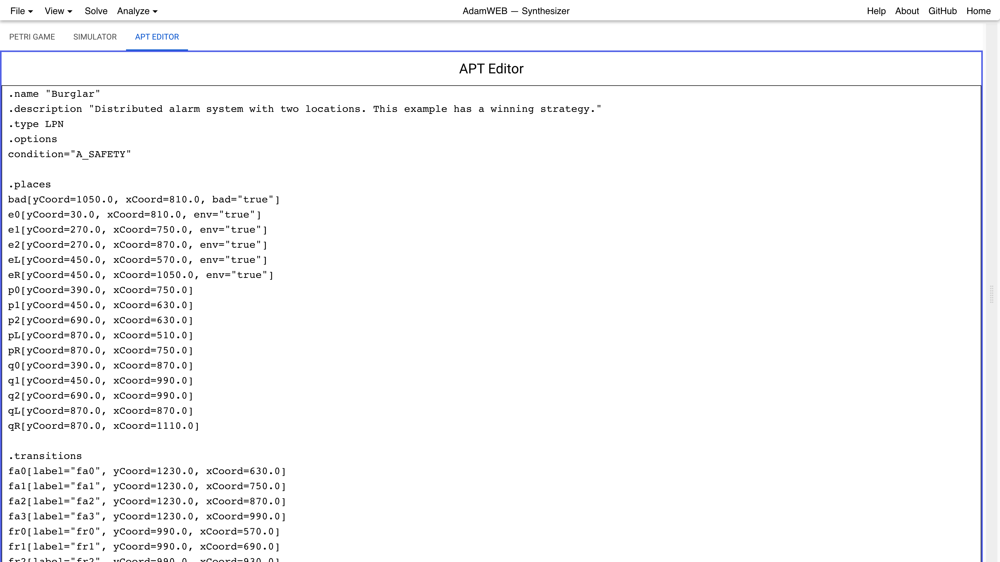
For the format please refer to [here](https://uol.de/f/2/dept/informatik/ag/csd/adam/Format.pdf).

Common Error Messages:
---------------------------
- *The places are not properly annotated with partition ids.*
 Please add a correct partition ID to each place of the input Petri game by using a right click on the place. See [here](#partitions). With *View->Show partitions* these partitions can be visualized.
- *There are more than one environment player in the game.*
 The synthesis approach only covers a bounded number of system players and one environment player. Therefore, at most one environment place is allowed in every reachable marking of the Petri game. Please change the structure of the Petri game to use only one environment player.
- *Net is not safe.*
 The synthesis approach is only implemented for safe Petri games, i.e., Petri games where in every reachable marking each place occurs at most once. Please change the structure of the Petri game to obtain a safe one.
